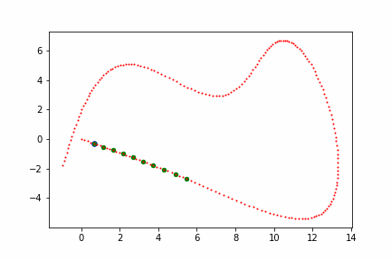

# Learning-based Model Predictive Control with Gaussian Process

# Description
This is simplified implementation of "Learning-based Model Predictive Control for Autonomous Racing" in which Gaussian-Processes are used to correct inaccurate physical models.
Procedure of creating model is as follow.

1.Collet training data (difference between experimental result and prediction generated from inaccurate dynamics model ). 
2.Train Gaussian-Process using collected data to predict next state given current state and control.  
3.Construct MPC using corrected dynamics model(inaccurate-model + Gaussian-Process). 

モデル予測制御において物理モデルが不正確だと性能が低下します。
このリポジトリではではガウス過程回帰を用いて不正確な物理モデルを補正することでより正確な物理モデルを構築するアルゴリズムを実装しています。
実装手順は以下のとおりです。

1.実測値と不正確な物理モデルによる予測値の差分のデータを収集。（現時点の状態＋制御入力→1時点先の状態） 
2.上記差分・制御の不確実性を予測するためのガウス過程回帰を学習。 
3.不正確な物理モデル＋ガウス過程回帰を用いてモデル予測制御を構築。 

See this paper for reference:
[Learning-based Model Predictive Control for Autonomous Racing](https://www.research-collection.ethz.ch/bitstream/handle/20.500.11850/351561/08754713.pdf?sequence=1&isAllowed=y)

# Result
●MPC with Accurate model 
正確な物理モデルによるMPC 
 
●MPC with INAccurate model 
不正確な物理モデルによるMPC 
 
●MPC with INAccurate model and Gaussian-Process 
不正確な物理モデル＋ガウス過程回帰によるMPC 
 

Red points show Waypoints   
Green points show Predicted path  
Blue points shows Actural Path  

赤：理想経路 
緑：MPCによる予測経路 
青：実際の経路 